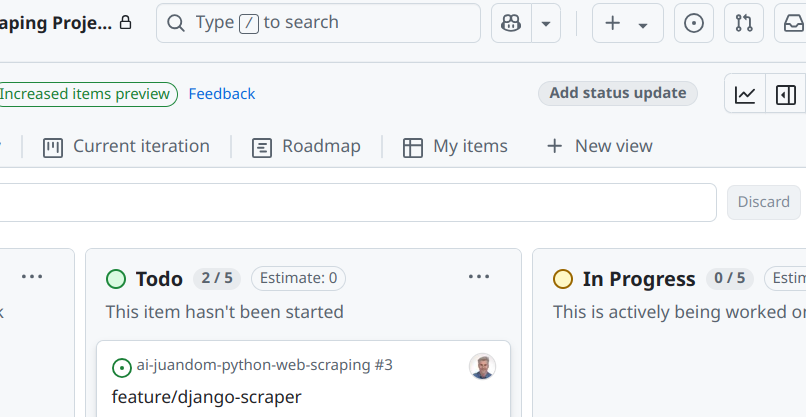
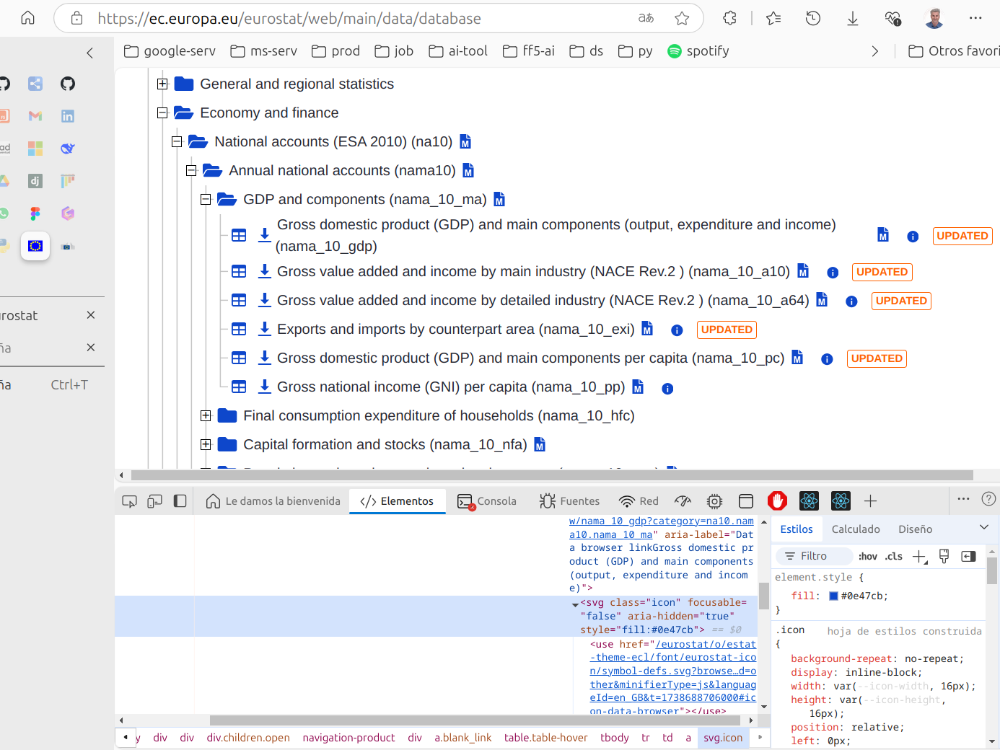
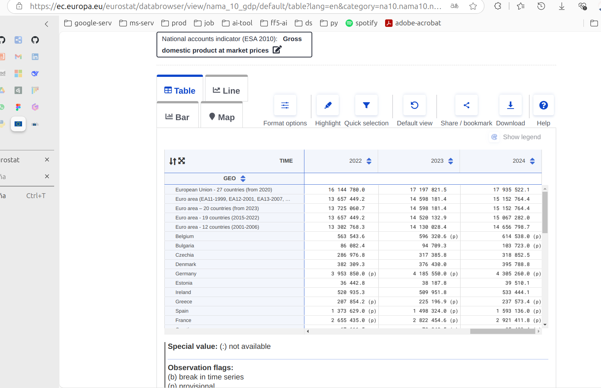
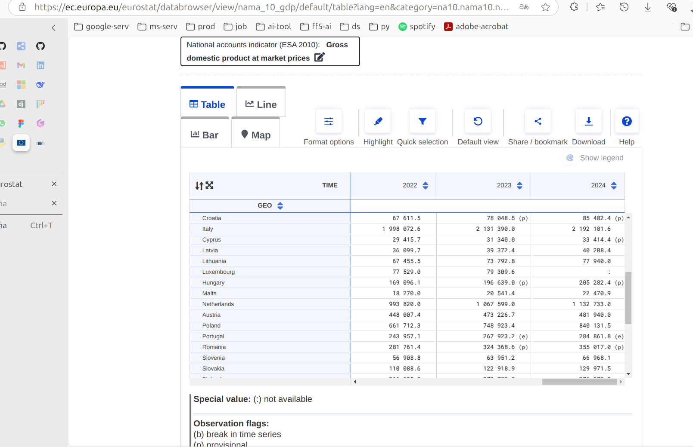

# 🌐 Eurostat Web Scraping


## 📖 Descripción del Proyecto

**Eurostat Web Scraping Project** es un sistema para extracción automatizada de datos estadísticos de [Eurostat](https://ec.europa.eu/eurostat), con capacidades de:

- **Web scraping** de tablas dinámicas con JavaScript
- **Procesamiento ETL** (Extracción, Transformación, Carga)
- **Visualización** mediante interfaz web Django --> No implementado
- **Exportación** a múltiples formatos (CSV)

pensado para realizar **estimaciones** sobre el desarrollo futuro de los **indicadores macroeconómicos** de la **Unión Europea**.

----------

🔍 **Tecnologías clave implementadas**:
```python
# Stack tecnológico completo
tech_stack = {
    "scraping": ["Selenium", "Pandas"],
    "backend": ["Django"],
    "data": ["Pandas", "NumPy"],
    "tools": ["UV", "WebDriver Manager"],
}
```

## 🚀 Características Principales

### 🔧 **Módulo de Scraping Avanzado**
```python
from selenium.webdriver import ChromeOptions
from bs4 import BeautifulSoup

# Configuración profesional discutida
options = ChromeOptions()
options.add_argument("--headless=new")  # Modo sin interfaz gráfica
options.add_argument("--disable-blink-features=AutomationControlled")
```

### 📊 **Procesamiento de Datos**
- Limpieza automática de valores especiales (`(b)`, `(e)`, `(p)`)
- Normalización de formatos numéricos europeos (`1.234,56` → `1234.56`)
- Identificación automática de metadatos (EU vs Eurozone)

---

## 🛠️ Requisitos Previos

| Componente       | Versión Mínima | Notas                          |
|------------------|----------------|--------------------------------|
| Python           | 3.13+          | Requiere soporte para type hints |
| Chrome/Firefox   | Latest         | Para ejecución del navegador    |
| UV               | 1.0+           | Alternativa moderna a pip       |

---

## ⚙️ Instalación

### Linux/macOS (Recomendado con UV)
```bash
# 1. Crear entorno virtual
python -m venv .venv && source .venv/bin/activate

# 2. Instalar UV (si no está instalado)
pip install uv

# 3. Instalar dependencias (desde pyproject.toml)
uv pip install -e .

# 4. Verificar
uv pip list
```

### Windows (PowerShell)
```powershell
# 1. Entorno virtual
py -m venv .venv; .venv\Scripts\activate

# 2. Instalar con UV
pip install uv
uv pip sync
```

### 🧪 Modo Desarrollo
```bash
# Instalar dependencias + herramientas de testing
uv pip install -e ".[dev]"

# Ejecutar tests (como discutimos)
pytest scraper/tests/ -v
```

---

> 💡 **Tip**: usa `uv pip compile --upgrade` para actualizar dependencias de forma segura y `uv pip sync` para replicar entornos exactos.

---

## 🏗️ Estructura del Proyecto

```bash
$ tree -L 3

ai-eurostat-python-web-scraping/
.
├── chromedriver.log
├── data
│   ├── gdp_data_20250323_200029.csv
│   ├── gdp_data_20250323_202231.csv
│   ├── gdp_data_20250323_204002.csv
│   ├── gdp_data_20250323_204952.csv
│   ├── gdp_data_20250323_205227.csv
│   ├── gdp_data_20250323_205721.csv
│   ├── gdp_data_20250323_210309.csv
│   ├── gdp_data_20250323_211352.csv
│   ├── gdp_data_20250323_212411.csv
│   ├── gdp_data_latest.csv
│   ├── table.py
│   └── table.xls
├── db.sqlite3
├── docs
│   └── images
│       ├── branches_structure.png
│       ├── Captura desde 2025-03-19 21-06-40.png
│       ├── Captura desde 2025-03-20 00-05-42.png
│       ├── Captura desde 2025-03-20 00-33-28.png
│       ├── Captura desde 2025-03-20 02-39-27.png
│       ├── Captura desde 2025-03-20 02-39-58.png
│       ├── Captura desde 2025-03-20 11-16-14.png
│       ├── Captura desde 2025-03-21 14-40-50.png
│       ├── Captura desde 2025-03-21 22-58-39.png
│       ├── Captura desde 2025-03-23 11-09-56.png
│       ├── Captura desde 2025-03-23 11-25-44.png
│       ├── Captura desde 2025-03-23 11-30-42.png
│       ├── Captura desde 2025-03-23 12-58-21.png
│       ├── corporative-img.webp
│       ├── dataset.png
│       ├── detail_numeric_data.png
│       ├── eurostat_data_structure.png
│       ├── initial_conf.png
│       ├── initial_researching.png
│       ├── spint_2.png
│       └── table_data.png
├── eurostat_manager
│   ├── admin.py
│   ├── asgi.py
│   ├── __init__.py
│   ├── management
│   │   ├── commands
│   │   ├── __init__.py
│   │   └── __pycache__
│   ├── migrations
│   │   ├── 0001_initial.py
│   │   ├── 0002_gdptabledata.py
│   │   ├── 0003_gdptabledata_year_2015_gdptabledata_year_2016_and_more.py
│   │   ├── 0004_remove_gdpdata_category_delete_gdptabledata_and_more.py
│   │   ├── __init__.py
│   │   └── __pycache__
│   ├── __pycache__
│   │   ├── admin.cpython-313.pyc
│   │   ├── __init__.cpython-313.pyc
│   │   ├── models.cpython-313.pyc
│   │   ├── settings.cpython-313.pyc
│   │   └── urls.cpython-313.pyc
│   ├── settings.py
│   ├── urls.py
│   └── wsgi.py
├── inspector
│   ├── first-gdp-value.html
│   ├── gdp-grid-values.html
│   ├── geo-headers.html
│   ├── geo-hs-gdp-values.html
│   ├── gpd-values-rows.html
│   └── index-time-headers.html
├── logs
│   └── scraper.log
├── manage.py
├── pyproject.toml
├── README.md
├── requirements.txt
├── scraper
│   ├── admin.py
│   ├── apps.py
│   ├── eurostat_scraper.py
│   ├── __init__.py
│   ├── migrations
│   │   ├── 0001_initial.py
│   │   ├── 0002_remove_gdptabledata_indicator.py
│   │   ├── 0003_remove_gdptabledata_year_2015_and_more.py
│   │   ├── 0004_alter_gdptabledata_geo_area.py
│   │   ├── 0005_remove_gdpdata_category_alter_gdptabledata_year_2019_and_more.py
│   │   ├── 0006_gdpdata_geoarea_delete_gdptabledata_gdpdata_geo_area_and_more.py
│   │   ├── __init__.py
│   │   └── __pycache__
│   ├── models.py
│   ├── __pycache__
│   │   ├── admin.cpython-313.pyc
│   │   ├── apps.cpython-313.pyc
│   │   ├── eurostat_scraper.cpython-313.pyc
│   │   ├── __init__.cpython-313.pyc
│   │   └── models.cpython-313.pyc
│   ├── tests.py
│   └── views.py
├── screenshots
│   ├── after_wait_for_table_20250325_085311.png
│   ├── after_wait_for_table_20250325_085436.png
│   ├── after_wait_for_table_20250325_085759.png
│   ├── after_wait_for_table_20250325_090153.png
│   ├── after_wait_for_table_20250325_090348.png
│   ├── before_wait_for_table_20250325_085432.png
│   ├── before_wait_for_table_20250325_085756.png
│   ├── before_wait_for_table_20250325_090149.png
│   ├── before_wait_for_table_20250325_090342.png
│   ├── cookies_accepted_20250325_085756.png
│   ├── cookies_accepted_20250325_090148.png
│   ├── cookies_accepted_20250325_090342.png
│   └── timeout_error_20250324_172036.png
└── uv.lock

18 directories, 163 files
```

---

## 💡 Uso Avanzado

### Ejemplo de Scraping con Retries
```python
from scraper.eurostat_scraper import EurostatScraper

with EurostatScraper(headless=True) as scraper:
    data = scraper.extract_complete_gdp_data()
    scraper.export_to_excel(data, "eurostat_data.xlsx")
```

### Comandos Django Personalizados
```bash
python manage.py import_eurostat_data \
    --years 2020-2023 \
    --countries "ES,FR,DE"
```

---

## 📌 Mejoras Implementadas:

1. **Manejo profesional de tablas dinámicas**:
   - Scroll horizontal automatizado
   - Detección de datos lazy-loaded

2. **Sistema de logging mejorado**:
   ```python
   # Configuración que desarrollamos
   logger.addHandler(RotatingFileHandler(
       "logs/scraper.log", 
       maxBytes=5*1024*1024, 
       backupCount=3
   ))
   ```

3. **Configuración avanzada de Selenium**:
   - Desactivación de imágenes para mejor rendimiento
   - Timeouts configurables por selector

---

## Capturas del Proceso

### 1. Configuración Inicial del Proyecto

*Figura 1: Establecimiento de tareas iniciales y milestones en el tablero de proyecto*

### 2. Investigación de Tecnologías
  
*Figura 2: Búsqueda de tecnologías adecuadas para web scraping (BeautifulSoup, Scrapy, Selenium)*

### 3. Estructura de Ramas Git
  
*Figura 3: Estructura de ramas con `main`, `develop` y `feature/` para desarrollo*

### 4. Progreso del Desarrollo
  
*Figura 4: Estado actual de las tareas en el sprint (2/5 completadas)*

### 5. Estructura de Datos Eurostat
  
*Figura 5: Jerarquía de datasets de GDP en Eurostat (ESA 2010 framework)*

### 6. Vista de Tabla de Datos
  
*Figura 6: Vista preliminar de los datos GDP por país/región*

### 7. Datos Numéricos Detallados
  
*Figura 7: Valores específicos de GDP con flags de calidad de datos*

-----

## Notas Técnicas

1. **Flags de Datos**:  
   - `(b)`: Break in time series (cambio metodológico)  
   - `(p)`: Provisional (datos preliminares)  
   - `(e)`: Estimated (estimación)  
   - `:`: Not available (no disponible)

2. **Estructura de Datos**:  
   Los datos siguen el estándar ESA 2010 de cuentas nacionales, con desglose por:
   - Componentes principales (output, expenditure, income)
   - Industrias (NACE Rev.2)
   - Áreas geográficas (EU, Euro area, países individuales)
  
---

## 📄 Licencia

Este proyecto está bajo licencia [GPLv3](https://www.gnu.org/licenses/gpl-3.0.html). Consulte el archivo `LICENSE` para más detalles.


